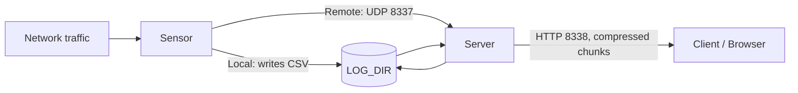

Maltrail is built around a three-component architecture: **Traffic → Sensor ↔ Server ↔ Client**. Each component has a clearly defined role, and they can run on the same machine or be distributed across a network. The design prioritises simplicity — the Server component can even be skipped entirely if you only need local log files.

## Component roles

### Sensor

The Sensor is the traffic-facing component. It runs on a monitoring node — typically a Linux machine connected passively to a SPAN or mirror port, or configured inline as a transparent bridge. It can also run on a standalone honeypot.

The Sensor uses `pcapy-ng` to capture raw packets from the configured interface (`MONITOR_INTERFACE`, default `any`). For each packet, it extracts the relevant field (destination IP, queried domain, requested URL, HTTP User-Agent, etc.) and checks it against the loaded trail blacklists. When a match is found, or when a heuristic fires, the Sensor emits an event.

Events are dispatched in one of two ways:

- **Local mode (default):** Events are written directly to the log directory (`LOG_DIR`, default `/var/log/maltrail/`) as CSV files. This is used when the Sensor and Server run on the same machine.
- **Remote mode:** When `LOG_SERVER` is set (e.g. `192.168.2.107:8337`), events are sent as UDP datagrams to a remote Server instead of being written locally.

Trail lists are updated automatically at startup and on a configurable schedule (`UPDATE_PERIOD`, default `86400` seconds). On first run or after a long offline period, the Sensor downloads the latest trail definitions from the configured feeds before monitoring begins.

### Server

The Server's primary role is to store event log entries and serve the HTTP reporting interface. It does not perform any packet capture.

- **Log storage:** Events arrive either from a co-located Sensor writing to the local `LOG_DIR`, or from remote Sensors sending UDP datagrams. When `UDP_ADDRESS` and `UDP_PORT` are configured, the Server listens on UDP port `8337` for incoming events from remote Sensors.
- **HTTP interface:** The Server runs a built-in HTTP server on port `8338` (configurable via `HTTP_PORT`). There is no need for a third-party web server like Apache or nginx.
- **Fat-client architecture:** The Server does not perform any log rendering or analysis. It transfers compressed log chunks to the browser, and all data post-processing happens client-side. This keeps the Server lightweight and avoids disrupting Sensor performance when both run on the same machine.

<Note>
  The Server component is optional. If you only need local log files and do not require the web reporting interface, you can run the Sensor alone. Log entries are written to `LOG_DIR` in CSV format and can be read with any standard CSV tool.
</Note>

### Client

The Client is a web browser — there is no dedicated client binary to install. When you navigate to the Server's HTTP address, the browser downloads the reporting web application and log data for the selected date.

All rendering, filtering, aggregation, and charting happens in the browser. Log data is received in compressed chunks and processed sequentially. This architecture means even very large event sets (100,000+ events) can be displayed efficiently without any server-side rendering load.

## Data flow diagram



## Distributed deployments

Multiple Sensors can report to a single central Server. Each Sensor is configured independently with its own `SENSOR_NAME` so that events from different nodes can be distinguished in the reporting interface.

To enable remote event forwarding on each Sensor, set the following in `maltrail.conf`:

```text
LOG_SERVER 192.168.2.107:8337
```

On the Server, uncomment and set the UDP listener:

```text
UDP_ADDRESS 0.0.0.0
UDP_PORT 8337
```

With this configuration, Sensors send events over UDP to the central Server, which stores them in `LOG_DIR` and makes them available through the web interface.

## Log format

Events are stored in `LOG_DIR` as daily CSV files (whitespace-delimited). Each file is named by date, for example `/var/log/maltrail/2015-10-19.log`. Each line represents a single detected event with the following fields:

```text
"2015-10-19 15:48:41.152513" beast 192.168.5.33 32985 8.8.8.8 53 UDP DNS 0000mps.webpreview.dsl.net malicious siteinspector.comodo.com
```

<AccordionGroup>
  <Accordion title="time">
    Timestamp of the event in `YYYY-MM-DD HH:MM:SS.microseconds` format, quoted with double quotes.
  </Accordion>
  <Accordion title="sensor">
    The name of the Sensor that generated the event, as configured by `SENSOR_NAME` in `maltrail.conf`. Defaults to `$HOSTNAME`. Used to distinguish events from multiple Sensors in a distributed deployment.
  </Accordion>
  <Accordion title="src_ip">
    Source IP address of the observed traffic.
  </Accordion>
  <Accordion title="src_port">
    Source port number of the observed traffic.
  </Accordion>
  <Accordion title="dst_ip">
    Destination IP address of the observed traffic.
  </Accordion>
  <Accordion title="dst_port">
    Destination port number of the observed traffic.
  </Accordion>
  <Accordion title="proto">
    Network protocol — for example, `UDP`, `TCP`, or `ICMP`.
  </Accordion>
  <Accordion title="trail_type">
    The category of the matched trail — for example, `DNS` (domain name lookup), `URL`, or `IP` (direct IP address match).
  </Accordion>
  <Accordion title="trail">
    The specific trail value that triggered the event — for example, a domain name like `0000mps.webpreview.dsl.net`, a URL, or an IP address.
  </Accordion>
  <Accordion title="trail_info">
    A human-readable description of the threat — for example, `malicious`, `known attacker`, or the malware family name. Populated from the feed or static trail definition.
  </Accordion>
  <Accordion title="reference">
    The source of the trail — for example, `(static)` for statically compiled trails, `(custom)` for user-defined entries, or the feed name (e.g. `siteinspector.comodo.com`) for dynamic feed entries.
  </Accordion>
</AccordionGroup>

## Trail types

Maltrail matches network traffic against four categories of trails:

| Type | Description | Example |
|---|---|---|
| Domain name | Matched against DNS query names | `zvpprsensinaix.com` (Banjori DGA) |
| URL | Matched against full HTTP request URLs | `hXXp://109.162.38.120/harsh02.exe` |
| IP address | Matched against source or destination IPs | `185.130.5.231` |
| HTTP User-Agent | Matched against the `User-Agent` request header | `sqlmap` |

Heuristic detections (when `USE_HEURISTICS` is enabled) are also recorded as events and use trail types such as `long domain name (suspicious)`, `excessive no such domain (suspicious)`, and `direct .exe download (suspicious)`.
